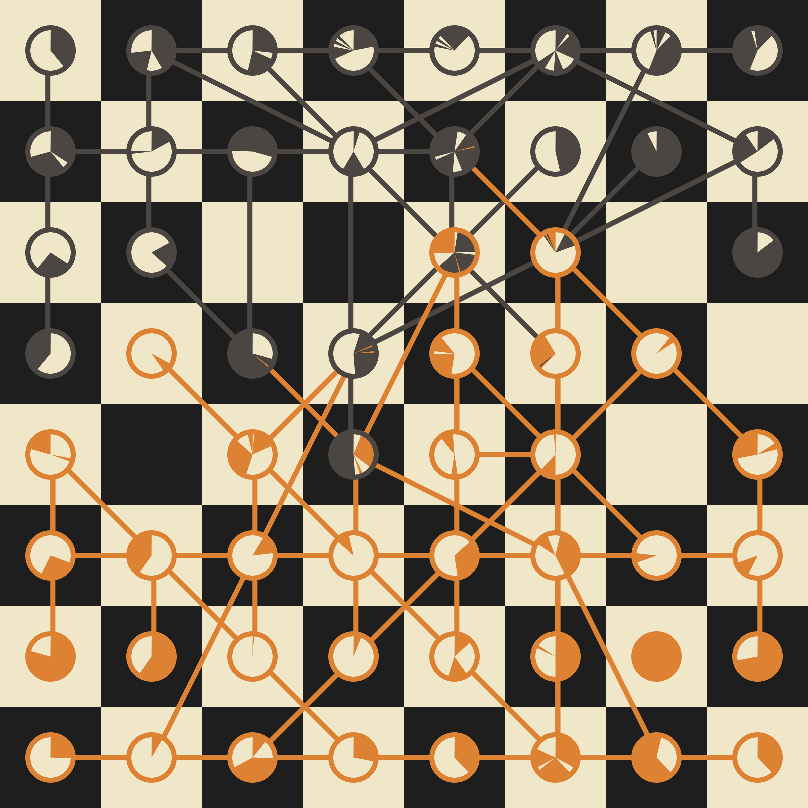

# chessviz

This project is an attempt to produce nice pictures out of chess games.



**Visualization of [Fischer vs Spassky game 6](https://www.chessgames.com/perl/chessgame?gid=1044366)**

## Python version

**Installation**

```sh
pip install -r requirements
```

**Usage**

```sh
python chessviz.py gid > board.svg
```

where `gid` is a game id from [chessgames](https://www.chessgames.com/).

## Browser version

The code was also ported to Javascript and runs at <https://louisabraham.github.io/chessviz/>. See in `index.html`.
