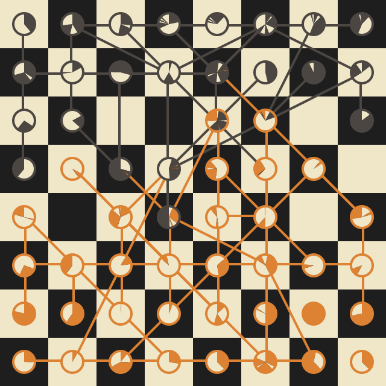

# chessviz

This project is an attempt to produce nice pictures out of chess games.



**Visualization of [Fischer vs Spassky game 6](https://www.chessgames.com/perl/chessgame?gid=1044366)**

## Features

- PGN scraping from https://www.chessgames.com/
- svg output
- web API


## Installation 

```sh
pip install -r requirements
```

## Usage

```sh
python chessviz.py gid > board.svg
```

where `gid` is a game id from [chessgames](https://www.chessgames.com/).

## API

```sh
python api.py
```

`launch.sh` gives a more stable way to launch the API using [Gunicorn](https://gunicorn.org/).

A demo is hosted on https://chess.smtd.me/. For example, to visualize [this game](https://www.chessgames.com/perl/chessgame?gid=1044366) you can go to https://chess.smtd.me/1044366.

## TODO

- Run the python code in-browser using [Pyodide](https://pyodide.org/en/stable/index.html). Until [this PR](https://github.com/pyodide/pyodide/pull/1956) is merged, [this code](https://github.com/pyodide/pyodide/pull/1956#issuecomment-1003649211) can be used for the scraping.

- Make a proper `setup.py` with the webserver as an option.